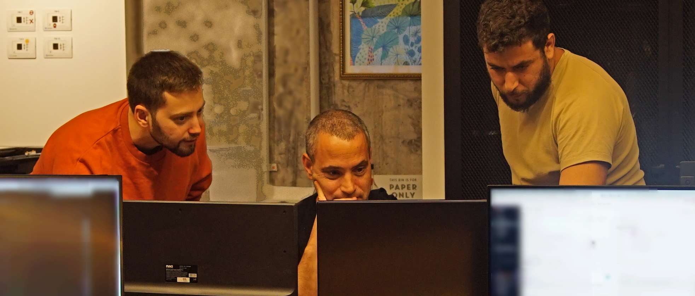

# Raz Peleg - Game Design Portfolio

This site aims to showcase my game design skills, focusing on technical knowledge and experience, artistic style, gameplay decision-making and career achievements so far.

  
  
That's me on the left in orange. These days my hair is longer, alluding to my experience since this photo was taken.

**Use the sidebar to navigate my site, or use these links to quickly get to my showcase projects:**
- [**Malshin Turbo**: 2D Side Scroller](pages/malshin-turbo.md)
- [**Rabin Square Simulator**: 3D Realistic Environment](pages/rabin-square-simulator.md)

Even though it sounds very boilerplate - my biggest strength is problem solving. I love breaking down the challenges, constraints and tools at my disposal, and working with my team to overcome them. Nothing beats the feeling of shared accomplishment.

My ultimate goal is to design video games that bring people and communities together to work on common goals, tell compelling stories, present significant challenges, and heavily reward players for overcoming them.

Since I'm early in my journey and still learning, if you have any feedback at all I'd be very appreciative if you could share it with me.
